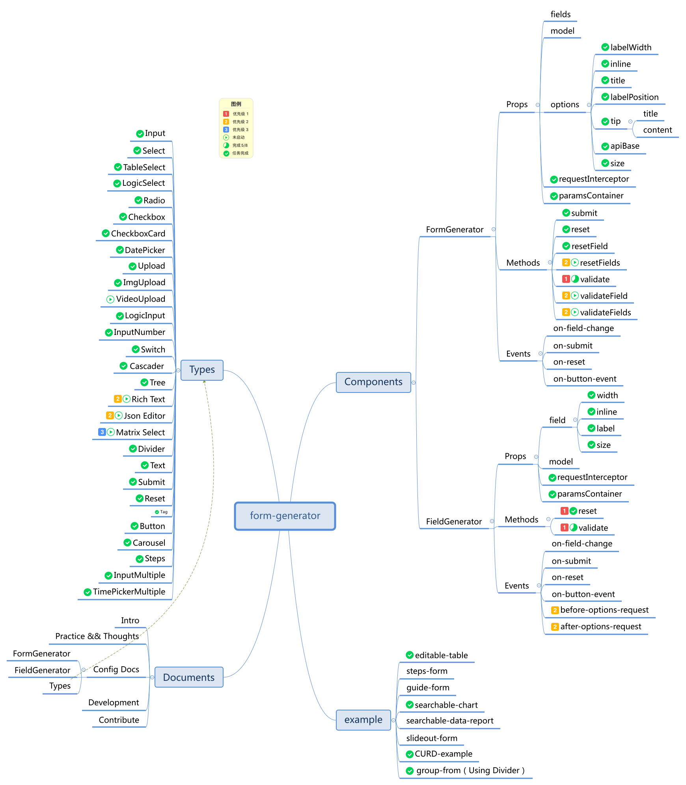

# form-generator-iview

## description

A form generator with json schema based on iview ui.

## design

## developer

[zhengxkq](https://github.com/zhengxkq),
[BingBlog](https://github.com/BingBlog),
[longkele](https://github.com/longkele/)
[xiaomiCat](https://github.com/xiaomiCat),
[changyuqing](https://github.com/changyuqing),
[Tobin1990](https://github.com/Tobin1990),
[glsnb](https://github.com/glsnb)

## development

`yarn run dev`

## production

`yarn run build`
