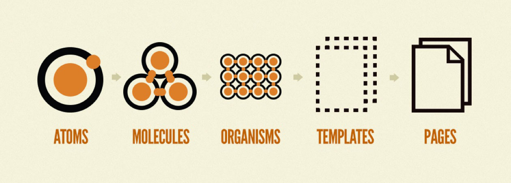

# CP(json-drived-configurable-platform)

[English README.md](./README-en.md)

中台前端UI可配置开发解决方案，通过可配置的模板来快速开发中台前端页面。

## 主要概念

前端组件化是对Atomic Design的实践，基于vue.js的[ant-design-vue](https://antdv.com)、[Element](https://element.eleme.io)、[iView](https://iviewui.com)和基于React的[Ant Design](https://ant.design)都是组件化的最佳实践。

这些项目更多的是解决了`组件`的复用问题，也就是`原子`和`分子`，并没有解决`组织`、`模板`这些个层面的复用的问题。`CP`打算提供一种实践方案，尝试解决上面的这两个问题。

`CP`主要基于可配置的基础模块，针对特定场景，开发出可复用的模板，来提升开发效率和代码复用程度，并使项目代码更易于维护。还可以将模板包装成插件，来跨项目复用。

你可以通过<a href="https://json-drived-configurable-platform.github.io/cp/#/doc/start">快速开始</a>中的说明，通过自己的实践理解这个方案。

### 模板复用

考虑一个场景：你需要开发一个包含了很多表单功能的项目：分步表单、增删该查列表、表格内编辑表单等。即使你使用上述哪些非常成熟的组件库，开发的工作量仍然非常巨大，而且大多都是重复工作。

CP提倡将通用场景封装成模板。你可以通过<a href="https://json-drived-configurable-platform.github.io/cp/#/doc/start">快速开始</a>这篇文档，在十分钟内就开发出一个数据报表平台。

> CP is only support for vue.js projects, beacause the `templates` supported are built on top of vue.js.

CP本身也提供了很多模板，我们也在持续丰富模板类型。<i><a href="https://json-drived-configurable-platform.github.io/cp-example">cp-example</a></i>展示了一个用CP构建的真实项目，里面包含了很多已经沉淀下来的非常成熟的模板。

### 强大的模块

模块是一些用于解决特定场景问题的可配置工具，大多数模板都基于这些工具开发，你也可以使用这些模块开发自己的模板。更多针对不同场景的模块也在设计和开发中，下面是两个已经较为完善的模块工具：

 - 1. <a href="https://json-drived-configurable-platform.github.io/form-generator-iview">FormGenerator</a> 可以帮助你通过JSON配置快速开发出表单应用，特别是像表格内置表单那样复杂的场景；

 - 2. <a href="https://json-drived-configurable-platform.github.io/data-vis-iview">DataVis</a>可以帮助你通过JSON配置快速实现数据报表相关的页面；
