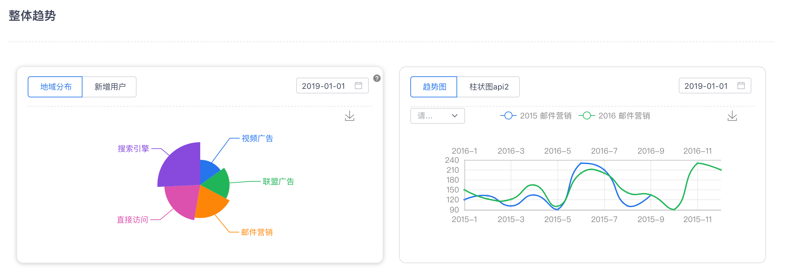

# dataVisIView

## Description

A charts generator with json schema based on iview ui.

- [x] table
- [x] lines
- [x] bar
- [x] pie
- [x] retain table
- [x] card
- [] map
- [] liquidFill https://gallery.echartsjs.com/editor.html?c=xSgRUrdtr_

## Quick Exmaple
```javascript
<template>
    <DataVis
        v-for="(item, index) in config"
        :key="index"
        ref="DataVis"
        :style="{marginTop: '40px'}"
        :config="item"
        :params-container="paramsContainer"
        :api-base="apiBase"
    />
</template>

<script>
import DataVis from 'data-vis-iview';
const config = {
    title: '整体趋势',
    rows: [
        [
            {
                conditions: [
                    {
                        key: '100060',
                        type: 'DatePicker',
                        subType: 'date',
                        model: 'date',
                        placeholder: '',
                        required: true,
                        defaultValue: '2019-01-01'
                    }
                ],
                chartGroup: [
                    {
                        'tip': {
                            title: '标题1',
                            content: '内容1'
                        },
                        'label':'地域分布',
                        'type':'pie',
                        'data': [
                            {value:335, name:'直接访问'},
                            {value:310, name:'邮件营销'},
                            {value:274, name:'联盟广告'},
                            {value:235, name:'视频广告'},
                            {value:400, name:'搜索引擎'}
                        ]
                    },
                    {
                        'label':'新增用户',
                        'type':'bar',
                        'columns': ['Mon', 'Tue', 'Wed', 'Thu', 'Fri', 'Sat', 'Sun'],
                        'data': [120, 200, 150, 80, 70, 110, 130]
                    }
                ]
            },
            {
                conditions: [
                    {
                        key: '100061',
                        type: 'DatePicker',
                        subType: 'date',
                        model: 'date',
                        placeholder: '',
                        required: true,
                        defaultValue: '2019-01-01'
                    }
                ],
                chartGroup: [
                    {
                        'label': '趋势图',
                        'type': 'line',
                        'columns': [
                            ['2015-1', '2015-2', '2015-3', '2015-4', '2015-5', '2015-6', '2015-7', '2015-8', '2015-9', '2015-10', '2015-11'],
                            ['2016-1', '2016-2', '2016-3', '2016-4', '2016-5', '2016-6', '2016-7', '2016-8', '2016-9', '2016-10', '2016-11', '2016-12']
                        ],
                        'data': [
                            {
                                name:'2015 邮件营销',
                                groupName: '邮件营销',
                                xAxisIndex: 0,
                                data:[120, 132, 101, 134, 90, 230, 210, 101, 134]
                            },
                            {
                                name:'2016 邮件营销',
                                groupName: '邮件营销',
                                xAxisIndex: 1,
                                data:[150, 122, 121, 164, 100, 200, 200, 141, 134, 90, 230, 210]
                            },
                            {
                                name:'2015 联盟广告',
                                groupName: '联盟广告',
                                xAxisIndex: 0,
                                data:[220, 182, 191, 234, 290, 330, 310, 101, 134, 90, 230]
                            },
                            {
                                name:'2016 联盟广告',
                                groupName: '联盟广告',
                                xAxisIndex: 1,
                                data:[20, 82, 91, 34, 90, 30, 10, 1, 34, 90, 30, 10]
                            }
                        ]
                    },
                    {
                        'tip': {
                            title: '标题2',
                            content: '内容2'
                        },
                        'label':'柱状图api2',
                        'type':'bar',
                        'api': '/chartBarApi'
                    }
                ]
            }
        ]
    ]
};
export default {
    components: {
        DataVis
    },
    data() {
        return {
            form: {
                config: JSON.stringify(config, null, 8)
            },
            config,
            paramsContainer: {
                test1: '1',
                test2: '2'
            },
            apiBase: ''
        };
    },
    methods: {
        handleConfigChange(e) {
            let config;
            try {
                config = JSON.parse(e.target.value || '') || [];
            } catch (error) {
                this.$Message('配置信息不是一个合法的json数据');
            }
            this.config = config;
        }
    }
};
</script>

```

Then get a result:




## Design


## Developer

abingblog@gmail.com

## development

`yarn run dev`

## production

`yarn run build`
